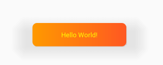

## 效果


## 功能
  属性 | 默认值 | 描述   
-|-|-
sm_autoRound | false | 自动圆角
sm_bgColor | 透明 | 背景色
sm_bgColor_sel | 透明 | 背景色选中状态
sm_roundRadius | 0 | 圆角半径
sm_gradient | false | 开启渐变色
sm_gradient_orientation | TOP_BOTTOM | 渐变方向
sm_bgColorFrom | 透明 | 渐变开始颜色
sm_bgColorFromSel | 透明 | 渐变开始颜色选中状态
sm_bgColorTo | 透明 | 渐变结束颜色
sm_bgColorToSel | 透明 | 渐变结束颜色选中状态
sm_textColor | BLACK | 文本色 同textColor
sm_textColorSel | BLACK | 文本色 选中状态

## 导入
* [](https://jitpack.io/#SmilingBoy/zqlib)
```groovy
allprojects {
		repositories {
		
			maven { url 'https://jitpack.io' }
		}
	}
	
dependencies {
    	 implementation 'com.github.SmilingBoy:zqlib:v1.0'
}

```

## 使用
```xml
<com.smile.zqview.SmTextView
    android:id="@+id/tv_sm"
    android:layout_width="200dp"
    android:layout_height="50dp"
    android:elevation="12dp"
    android:gravity="center"
    android:text="Hello World!"
    android:textColor="#FF0"
    app:sm_autoRound="false"
    app:sm_bgColor="#0FF"
    app:sm_bgColorFrom="#FF9800"
    app:sm_bgColorFromSel="#090"
    app:sm_bgColorTo="#FF5722"
    app:sm_bgColorToSel="#900"
    app:sm_bgColor_sel="#FFFF11"
    app:sm_gradient="true"
    app:sm_gradient_orientation="LEFT_RIGHT"
    app:sm_roundRadius="10dp"
    app:sm_textColorSel="@color/colorPrimary" />
```